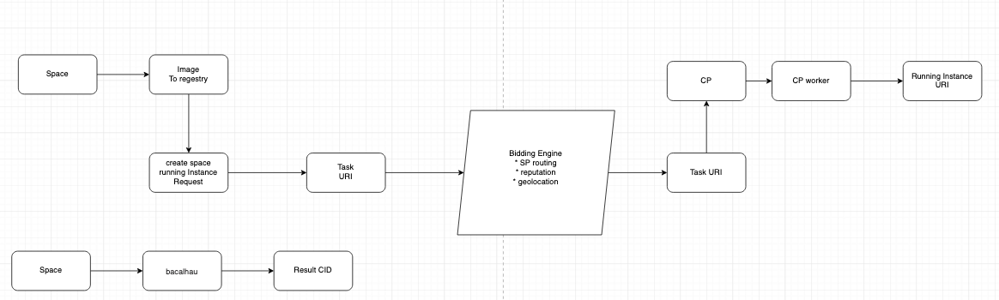

#### Lagrange Asynchronous Tasks  Pipeline

As a pipeline, the states are changing according to the build needs.

Standard build process:

* Webhook trigger
* Task creation
    * Task details from CID
    * Download the Space
    * Make build
    * Push to the remote docker hub
    * Clean up
        * build file
        * local cache
        * images

## Installation

### Install  from Source code

**Install and Start Redis**

```shell
 docker run -d --name computing_provider -p 6379:6379 redis/redis-stack-server:latest 
```

**computing provider**

```shell
git clone https://github.com/lagrangedao/computing-provider
cp .env_smaple .env
```
for variables in the .env file

```dotenv
MCS_API_KEY= <From multichain.storage>
MCS_ACCESS_TOKEN= <From multichain.storage>
MCS_BUCKET=<Your bucket name in multichain.storage>
FILE_CACHE_PATH= <local folder name for store local file, e.g.temp_file >
OUR_DOCKER_USERNAME= < for login docker hub>
OUR_DOCKER_PASSWORD=< for login docker hub>
OUR_DOCKER_EMAIL=< for login docker hub>
```


Setup config file
```shells
cp config/config_template.toml config/config.toml
```
For values in config.toml

```dotenv
api_url = "https://api.lagrangedao.org"
computing_provider_name = <Your computing provider name>
multi_address = "/ip4/<Your public ip>/tcp/<your port>"
lagrange_key = "xxxxx" <Check the document below for how to get it>
domain_name = <domain name for job result uri>
```

How to get lagrange_key
* Go to lagrangedao.org and connet with your wallet
* Open https://lagrangedao.org/personal_center/setting/tokens, create a new token

Start the CP Node
```shell
sudo apt install -y gunicorn
pip install -r requirements.txt
gunicorn -c "python:config.gunicorn" --reload "computing_provider.app:create_app()"
```
You will see the following output if start properly:
```shell
[2023-04-17 00:28:09 -0400] [916988] [INFO] Starting gunicorn 20.1.0
[2023-04-17 00:28:09 -0400] [916988] [INFO] Listening at: http://0.0.0.0:8000 (916988)
[2023-04-17 00:28:09 -0400] [916988] [INFO] Using worker: sync
[2023-04-17 00:28:09 -0400] [916989] [INFO] Booting worker with pid: 916989
[2023-04-17 00:28:09,602] INFO in node_service: Found key in .swan_node/private_key
[2023-04-17 00:28:09,604] INFO in boot: Node started: 0x601e25ab158ba1f7
```


Start a CP worker

```shell
sudo apt install -y python-celery-common 
celery --app computing_provider.computing_worker.celery_app worker --loglevel "${CELERY_LOG_LEVEL:-INFO}"
```

### Install with Docker

Build all services:

```bash
docker-compose build
```

Start all services:

```bash
docker-compose up
```

Stop all serivces:

```bash
docker-compose stop
```
